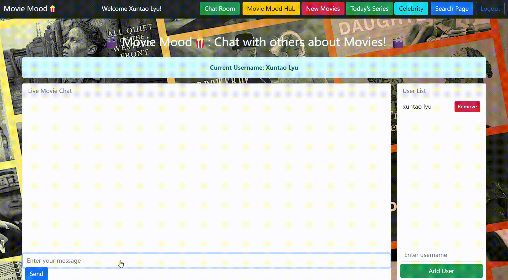

# <i> Movie Mood🍿: Movie Recommendations for your Personal Feeling </i>

# [Check our Wiki Page for detailed information about the project!](https://github.com/The-Powerpuff-Girls3/CSC-510-Movie-Mood/wiki/Project-Wiki)

<b>Movie Mood is an invitation to explore the boundless realms of cinema. With a constantly expanding library of films, an intuitive recommendation algorithm, a vibrant new chat room, a seamless account system, and a robust review platform, PopcornPicks transforms the way you discover, enjoy, and engage with movies. It’s a gateway to unforgettable cinematic adventures.</b>

# Contents

- [ Movie Mood🍿: Movie Recommendations for your Personal Feeling ](#-movie-mood-movie-recommendations-for-your-personal-feeling-)
- [Check our Wiki Page for detailed information about the project!](#check-our-wiki-page-for-detailed-information-about-the-project)
- [Contents](#contents)
  - [Why use Movie Mood?](#why-use-movie-mood)
  - [Project Presentation Video](#project-presentation-video)
  - [Project Description](#project-description)
  - [Core Applications of the Project](#core-applications-of-the-project)
    - [Engaging in NEW Interactive UI](#engaging-in-new-interactive-ui)
    - [User Authentication](#user-authentication)
      - [Sign up: Users can register to Movie Mood for personalized recommendations based on their emotional state.](#sign-up-users-can-register-to-movie-mood-for-personalized-recommendations-based-on-their-emotional-state)
      - [Login:](#login)
    - [Personalized Profile Page for Users](#personalized-profile-page-for-users)
    - [Check Out New and Upcoming Movies](#check-out-new-and-upcoming-movies)
    - [Movie Recommendation Mechanism](#movie-recommendation-mechanism)
    - [Write Movie Reviews](#write-movie-reviews)
    - [See What Others Have Seen](#see-what-others-have-seen)
    - [Chat Room](#chat-room)
    - [❤️Based on preivous project, we added two new UI tabs!❤️](#️based-on-preivous-project-we-added-two-new-ui-tabs️)
    - [today's series](#todays-series)
    - [celebrity](#celebrity)
  - [Tech stack Used👨‍💻:](#tech-stack-used)
  - [Getting Started](#getting-started)
  - [Future Scope](#future-scope)
  - [Contribute to the Project!](#contribute-to-the-project)
  - [Contributors](#contributors)
  - [Contact Us](#contact-us)
  - [License](#license)

## Why use Movie Mood?

**Movie Mood: Match your mood with the perfect movie!**

- **Pravite:** Share your feelings with invited users. 
- **Efficient:** Quick, tailored recommendations to match your current mood. 
- **Adaptable:** Suggestions shift based on your feedback and feelings.
- **Accessible:** Works seamlessly across different platforms.
- **Engaging:** Discover movies that reflect your emotional state.
- **Interactive:** Chat about your recommendations with friends or the Movie Mood community.
- **Simple:** Easy installation and setup – start exploring mood-based movie recommendations instantly!

## Project Presentation Video

You can see the project presentation at - [YouTube link]

## Project Description

Movie Mood is a personalized movie recommendation platform that curates a list of 10 movies based on your emotional state. Users can select their current mood, and our algorithm suggests movies that align with that mood. The platform also allows you to provide feedback—Liked, Disliked, or Neutral—which helps refine future recommendations. Users can also write reviews, share them, and see what others are watching and reviewing. For more details on the system architecture and user flow, please refer to our [wiki page](https://github.com/The-Powerpuff-Girls3/CSC-510-Movie-Mood/wiki/Project-Wiki).

## Core Applications of the Project

### Engaging in NEW Interactive UI

### User Authentication

#### Sign up: Users can register to Movie Mood for personalized recommendations based on their emotional state.

#### Login: 

### Personalized Profile Page for Users

<video src="./asset/profile.mp4" controls></video>

### Check Out New and Upcoming Movies

### Movie Recommendation Mechanism

### Write Movie Reviews

### See What Others Have Seen

### Chat Room

### ❤️Based on preivous project, we added two new UI tabs!❤️
### today's series

### celebrity

Right now, users can enjoy more content from our website!!!

## Tech stack Used👨‍💻:

<code></code>
<code></code>
<code></code>
<code></code>
<code></code>
<code></code>
<code></code>

 

 
 
 

## Getting Started

Step 1:
Git Clone the Repository:
    git clone https://github.com/The-Powerpuff-Girls3/CSC-510-Movie-Mood.git

Step 2:
Install the required packages:
    pip install -r requirements.txt

Step 3:
Get a TMDB API KEY:
    To get an API from TMDB:
    * Signup to your https://www.themoviedb.org/signup
    * Under the Account icon, click Settings.
    * On the API page, click on the link under the Request an API Key section.
    * Register an API key.
    * Agree to the terms of use and fill in the required information.
    
Step 4:
Create a .env file:
     # .env
     TMDB_API_KEY=YOUR_TMDB_API_KEY
     
Step 5:
Run the following commands:
    cd app
    python init_db.py
    python run.py
    
Step 6:
Open the URL in your browser:
    http://127.0.0.1:8000/

<b>Finally, start matching your mood with the perfect movies!</b>

## Future Scope

Movie Mood has great potential for future expansion. Here are some exciting ideas for growth:

1. **Enhanced User Profiles:** Include features for users to edit or delete reviews, and avoid duplicate entries.
2. **Integration with Streaming Services:** Connect with streaming platforms to show availability of recommended movies in real-time.
3. **Dynamic Chat Rooms:** Allow movie-specific chat rooms to facilitate more targeted discussions.
4. **Improved Mood-Based Recommendation Algorithm:** Refine the algorithm using advanced machine learning models to provide better accuracy in mood-based suggestions.
5. **Interactive Review System:** Enable users to comment on each other's reviews to foster community engagement.
6. **TV Show Recommendations:** Add a dedicated section for TV shows, curated based on mood, just like the movie section.
7. **Mood Tracker:** Allow users to track their moods over time and see how their movie preferences change with their emotions.
8. **Collaborative Mood Movie Lists:** Implement a feature for friends to collaboratively create shared movie lists based on mutual moods.

## Contribute to the Project!

Please refer to the [CONTRIBUTING.md](https://github.com/The-Powerpuff-Girls3/CSC-510-Movie-Mood/blob/master/CONTRIBUTING.md) for guidelines on contributing. Raise a pull request, and we'd love to review it ❤️❤️!

## Contributors

[Hua Yang](https://github.com/HuaYangttt)
[Yinan Wu](https://github.com/YinanWusoymilk)
[Xuntao Lyu](https://github.com/lvxuntao)

## Contact Us

If you have any concerns or questions related to Movie Mood, feel free to reach out to us at moviemoodhelp@gmail.com.

## License

This project is under the MIT License.
